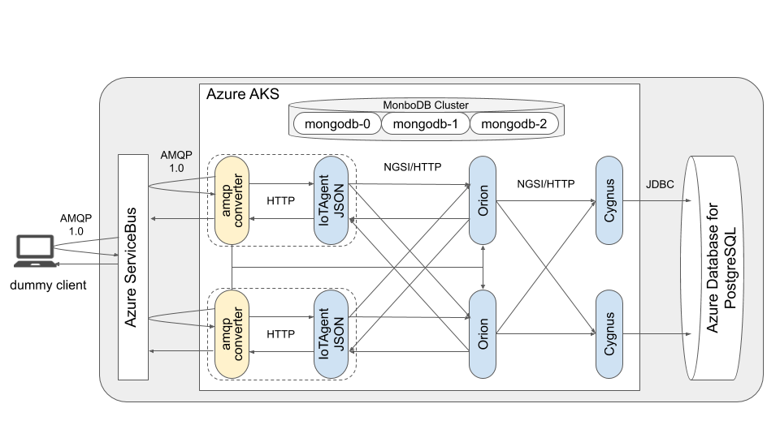

# qiita\_azure\_fiware
A demonstration to construct FIWARE IoT platform on Microsoft Azure.



## Getting started
### set your variable
1. copy `variables/env.azure.temp` to `variables/env.azure`, and edit variables to your own.
1. copy `variables/env.fiware.temp` to `variables/env.fiware`, and edit variable if you want.

### start Azure managed services
1. log in Azure

    ```bash
    $ ./installation/azure/01_login.sh
    ```
1. create resource group

    ```bash
    $ ./installation/azure/02_create_resourcegroup.sh
    ```
1. start Azure AKS

    ```bash
    $ ./installation/azure/03_start_aks.sh
    ```
1. start Azure ServiceBus

    ```bash
    $ ./installation/azure/04_start_servicebus.sh
    ```
1. after started Azure AKS, start Azure Database for PostgreSQL

    ```bash
    $ ./installation/azure/05_start_postgres.sh
    ```
### start MongoDB on Azure AKS
1. start MongoDB Cluster

    ```bash
    $ ./installation/fiware/01_start_mongodb.sh
    ```
### start FIWARE components
1. after started MongoDB Cluster, start FIWARE Orion

    ```bash
    $ ./installation/fiware/02_start_orion.sh
    ```
1. after started MongoDB Cluster and FIWARE Orion, start FIWARE IoTAgent JSON

    ```bash
    $ ./installation/fiware/03_start_iotagent-json.sh
    ```
1. start FIWARE Cygnus

    ```bash
    $ ./installation/fiware/04_start_cygnus-postgresql.sh
    ```
1. create a table for FIWARE Cygnus on Azure Database for PostgreSQL

    ```bash
    $ ./installation/fiware/05_create_table.sh
    ```
### set up FIWARE IoTAgent JSON and FIWARE Orion
1. register Service Group(s) to FIWARE IoTAgent JSON

    ```bash
    $ ./settings/fiware/01_register_servicegroup.sh
    ```
1. register Device(s) to FIWARE IoTAgent JSON

    ```bash
    $ ./settings/fiware/02_register_devices.sh
    ```
1. register Subscription(s) to FIWARE Orion

    ```bash
    $ ./settings/fiware/03_register_subscription.sh
    ```
### try to send and receive amqp messages between FIWARE on Azure and dummy IoT device
1. build a docker container as dummy IoT device

    ```bash
    $ ./execution/01_create_dummyclient.sh
    ```
1. send attributes from dummy IoT device to FIWARE on Azure

    ```bash
    $ ./execution/02_send_attributes.sh
    ```
    ```bash
    $ ./execution/03_show_orion.sh
    ```
    ```bash
    $ ./execution/04_show_postgres.sh
    ```
1. send a command to FIWARE Orion

    ```bash
    $ ./execution/05_send_cmd.sh
    ```
    ```bash
    $ ./execution/06_show_queue.sh
    ```
1. receive the command from Azure ServiceBus and send a command resule to FIWARE

    ```bash
    $ ./execution/07_process_cmd.sh
    ```
    ```bash
    $ ./execution/03_show_orion.sh
    ```
    ```bash
    $ ./execution/04_show_postgres.sh
    ```

## License

[MIT License](/LICENSE)

## Copyright
Copyright (c) 2020 [Nobuyuki Matsui](mailto:nobuyuki.matsui@gmail.com)

